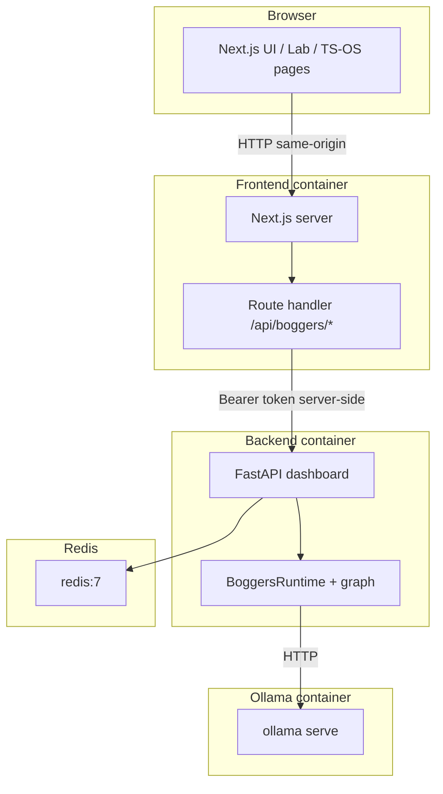

# BoggersTheAI-Dev

**Integrated development and deployment stack for the Thinking System / TS-OS** — combining the official [**BoggersTheAI**](https://github.com/BoggersTheFish/BoggersTheAI) runtime (FastAPI dashboard, wave engine, SQLite graph, Ollama) with the [**boggersthefish-site**](https://github.com/BoggersTheFish/boggersthefish-site) Next.js frontend so the public site can talk to a **real** TS-OS instance, not only the client-side mini-simulator.

This repository tracks **[boggersthefish.com](https://boggersthefish.com)** roadmap: **Wave 12** (Pages Island LIVE) baseline, **Wave 14** (Docker one-click) **shipped**, **Wave 13** (Distributed Graph — sharding + multi-agent) **implemented** in code and APIs, and **Wave 15** (WASM port) via [`wasm/ts-os-mini`](wasm/ts-os-mini) + [`/wasm`](frontend/src/app/wasm/page.tsx) in the Next app.

---

## Table of contents

1. [Why this repo exists](#why-this-repo-exists)
2. [Roadmap alignment](#roadmap-alignment)
3. [Architecture](#architecture)
4. [Repository layout](#repository-layout)
5. [Prerequisites](#prerequisites)
6. [Quick start: Docker (recommended)](#quick-start-docker-recommended)
7. [Local development (without Docker)](#local-development-without-docker)
8. [Configuration](#configuration)
9. [Networking and security](#networking-and-security)
10. [API surface](#api-surface)
11. [Production deployment](#production-deployment)
12. [Staying in sync with upstream](#staying-in-sync-with-upstream)
13. [Troubleshooting](#troubleshooting)
14. [Documentation index](#documentation-index)
15. [License](#license)

---

## Why this repo exists

The marketing site and lab pages describe a **local-first** TS-OS: a persistent graph, a background wave cycle, and a FastAPI observability layer. Upstream ships **BoggersTheAI** and **boggersthefish-site** as separate repositories. **BoggersTheAI-Dev** glues them for:

- **One `docker compose up` path** to Ollama + backend + frontend (+ optional Caddy for TLS).
- **Server-side proxying** of dashboard APIs so `BOGGERS_DASHBOARD_TOKEN` never has to ship in browser bundles as `NEXT_PUBLIC_*`.
- **Live lab UX**: polling `/status`, posting to `/query`, and optional session headers for future multi-tenant work.

---

## Roadmap alignment

| Wave | Site label | Role in this repo |
|------|------------|-------------------|
| **12** | Pages Island LIVE | Baseline: real FastAPI + real Next.js when compose is up. |
| **13** | Distributed Graph (Q2) | **Implemented:** shard router + coordinator, `/distributed/*` API, optional Redis multi-agent — see [`docs/WAVE13.md`](docs/WAVE13.md). |
| **14** | Docker One-Click | **Shipped:** `docker compose up`, volumes, healthchecks, `redis`, optional Caddy TLS. |
| **15** | WASM Port | **Implemented:** Rust `wasm/ts-os-mini`, `/wasm` page, `scripts/build-wasm.sh` — see [`docs/WAVE15.md`](docs/WAVE15.md). |

Official philosophy and loop description: [TS-OS page](https://boggersthefish.com/ts-os), install steps: [Lab](https://boggersthefish.com/lab).

---

## Architecture



- **Browser** calls only the Next origin (e.g. `http://localhost:3000`). It uses paths like `/api/boggers/status` and `/api/boggers/query`.
- **Next.js route handler** forwards to `BOGGERS_INTERNAL_URL` (e.g. `http://backend:8000`) and attaches `BOGGERS_DASHBOARD_TOKEN` when set.
- **Backend** reads `config.yaml` (Docker: bind-mounted [`config.docker.yaml`](config.docker.yaml)) with `inference.ollama.base_url` pointing at the **`ollama`** service.
- **Persistent data**: named volume for `/data` (SQLite `graph.db`, vault, traces, snapshots) and volume for Ollama model cache.

---

## Repository layout

| Path | Purpose |
|------|---------|
| [`backend/`](backend/) | **BoggersTheAI** — Python package, `dashboard/app.py`, `config.yaml`, tests. |
| [`frontend/`](frontend/) | **boggersthefish-site** — Next.js 15 App Router, lab, proxy under `src/app/api/boggers/`. |
| [`config.docker.yaml`](config.docker.yaml) | Compose profile: Ollama URL `http://ollama:11434`, paths under `/data`. |
| [`docker-compose.yml`](docker-compose.yml) | Services: `ollama`, `redis`, `backend`, `frontend`; optional `caddy` (`--profile tls`). |
| [`Caddyfile`](Caddyfile) | TLS + reverse proxy to `frontend:3000` when using the TLS profile. |
| [`scripts/deploy.sh`](scripts/deploy.sh) | Build, up, `ollama pull`, quick health curls. |
| [`docs/README.md`](docs/README.md) | Index of runbooks and wave docs. |
| [`docs/VPS.md`](docs/VPS.md) | Firewall, swap, backups, systemd. |
| [`docs/WAVE13.md`](docs/WAVE13.md) | Wave 13 — sharding + multi-agent. |
| [`docs/WAVE15.md`](docs/WAVE15.md) | Wave 15 — WASM crate + `/wasm`. |
| [`wasm/ts-os-mini`](wasm/ts-os-mini) | Rust → WebAssembly (wasm-pack). |
| [`scripts/verify-stack.sh`](scripts/verify-stack.sh) | Post-deploy HTTP checks. |
| [`scripts/backup-volumes.sh`](scripts/backup-volumes.sh) | Volume tarball backup. |
| [`systemd/ts-os.service`](systemd/ts-os.service) | Example unit wrapping `docker compose`. |
| [`.github/workflows/ts-os-smoke.yml`](.github/workflows/ts-os-smoke.yml) | CI: compose config, image builds, backend pytest, frontend build, wasm-pack. |

---

## Prerequisites

- **Docker** + Docker Compose v2 (for the full stack).
- **Optional local dev:** Python ≥ 3.10, Node.js 18+, **Ollama** installed for LLM/embeddings when not using Docker.

---

## Quick start (Docker) (recommended)

```bash
git clone https://github.com/BoggersTheFish/BoggersTheAI-Dev.git
cd BoggersTheAI-Dev

cp .env.example .env
# Set BOGGERS_DASHBOARD_TOKEN for any shared/hosted deployment

docker compose up -d --build
```

Optional one-shot helper (Linux/macOS):

```bash
bash scripts/deploy.sh
```

**Verification** (after containers are healthy):

```bash
bash scripts/verify-stack.sh
# or: make verify
```

- **UI:** [http://localhost:3000](http://localhost:3000) — try **Lab** for live `/status` polling and **Push a Node** → `POST /query` via the proxy.
- **Wave 15:** [http://localhost:3000/wasm](http://localhost:3000/wasm) — browser TS-OS Mini; optional native WASM via `bash scripts/build-wasm.sh`.
- **Backend (debug):** [http://localhost:8000/health/live](http://localhost:8000/health/live)
- **Ollama API (host):** port `11434` mapped in compose.

**HTTPS / Caddy** (production-style):

```bash
# Set CADDY_DOMAIN in .env to your hostname, then:
docker compose --profile tls up -d
```

---

## Local development (without Docker)

### Backend

```bash
cd backend
pip install -e ".[llm,adapters,agents]"
# copy/env: ensure config.yaml exists; start Ollama locally; for Wave 13 agents, run Redis or use in-memory fallback
dashboard-start
# → http://localhost:8000
```

### Frontend

```bash
cd frontend
npm install
cp .env.example .env.local
# BOGGERS_INTERNAL_URL=http://127.0.0.1:8000
# BOGGERS_DASHBOARD_TOKEN=...   if your dashboard uses a token
npm run dev
# → http://localhost:3000
```

Parity note: upstream docs sometimes mention `python main.py`; this project standardizes on **`dashboard-start`** / uvicorn for the FastAPI dashboard, consistent with the BoggersTheAI README.

---

## Configuration

| Concern | Source |
|--------|--------|
| Graph + wave + Ollama | `backend/config.yaml` locally; in Docker, [`config.docker.yaml`](config.docker.yaml) mounted as `/app/config.yaml`. |
| Dashboard bind | `BOGGERS_DASHBOARD_HOST`, `BOGGERS_DASHBOARD_PORT` |
| Auth | `BOGGERS_DASHBOARD_TOKEN` (must match between `backend` and `frontend` services when using the Next proxy). |
| CORS (browser → FastAPI direct) | `BOGGERS_CORS_ORIGINS` (comma-separated). Prefer same-origin `/api/boggers` in production. |
| Next → backend URL | `BOGGERS_INTERNAL_URL` (server-only; never `NEXT_PUBLIC_*`). |
| Public API base path (client) | `NEXT_PUBLIC_BOGGERS_API_BASE` (default `/api/boggers`). |
| Wave 13 Redis (multi-agent) | `REDIS_URL` (compose default `redis://redis:6379/0`). |
| Wave 13 sharding (logical API) | `BOGGERS_DISTRIBUTED_ENABLED`, `BOGGERS_SHARD_COUNT`, `BOGGERS_GLOBAL_MAX_NODES`, `BOGGERS_PER_SHARD_MAX_NODES` |

Strict config validation: `BOGGERS_CONFIG_STRICT=1` in the backend environment.

---

## Networking and security

- **Tokens:** Treat `BOGGERS_DASHBOARD_TOKEN` as a secret; rotate by updating `.env` and recreating containers.
- **Rate limiting:** `POST /query` is limited per **session header or IP** (slowapi `key_func`) on the FastAPI app.
- **Session header:** Clients may send `X-Boggers-Session-ID` (used for rate-limit keying when present); not a substitute for auth.
- **Edge:** For public internet, put HTTPS in front (Caddy profile or external CDN) and restrict exposed ports (see [`docs/VPS.md`](docs/VPS.md)).

---

## API surface (high level)

Backend routes (proxied under `/api/boggers/` by Next):

| Route | Purpose |
|-------|---------|
| `GET /health/live` | Liveness |
| `GET /status` | Wave + graph counts (auth if token set) |
| `GET /graph`, `GET /graph/viz` | Graph JSON / Cytoscape UI |
| `POST /query` | Full `handle_query` pipeline |
| `GET /wave` | Chart.js tension page |
| `GET /metrics/prometheus` | Prometheus text (auth if token set) |
| `GET /distributed/status`, `POST /distributed/assign` | Wave 13 shard coordinator (`BOGGERS_DISTRIBUTED_ENABLED=1`) |
| `GET /agents/status`, `POST /agents/tasks`, `POST /agents/tasks/wait` | Wave 13 multi-agent queue (Redis or memory) |

---

## Production deployment

- **Script:** [`scripts/deploy.sh`](scripts/deploy.sh)
- **Runbook:** [`docs/VPS.md`](docs/VPS.md) — UFW, swap, volume backups, optional systemd.
- **systemd:** [`systemd/ts-os.service`](systemd/ts-os.service) — `WorkingDirectory` should point to your clone path on the server.

---

## Staying in sync with upstream

`backend/` and `frontend/` are maintained from:

- https://github.com/BoggersTheFish/BoggersTheAI  
- https://github.com/BoggersTheFish/boggersthefish-site  

To refresh from upstream (when using plain copies without submodules), replace those trees with fresh clones or merge vendor updates manually, then re-apply this repo’s compose/Docker/proxy patches as needed.

Optional reference repos for Wave 13 / theory: **TS-Core**, **BoggersThePulse**, **GOAT-TS** (see [boggersthefish.com/projects](https://boggersthefish.com/projects)).

---

## Troubleshooting

| Symptom | Check |
|--------|--------|
| Lab shows “offline preview” | Backend up? `GET /api/boggers/status` via Next returns 200? Token mismatch between services? |
| `401` on API | Set `BOGGERS_DASHBOARD_TOKEN` consistently for `backend` + `frontend`. |
| Ollama errors | `docker compose exec ollama ollama pull llama3.2` and embedding model per `config.docker.yaml`. |
| SQLite permission errors | `/data` volume; entrypoint `chown`s for user `boggers`. |
| Agent queue / Redis errors in logs | Ensure `redis` is up in compose, or set `REDIS_URL` for local Redis; multi-agent falls back to memory if Redis is unavailable (see [`docs/WAVE13.md`](docs/WAVE13.md)). |

---

## Documentation index

- **[docs/README.md](docs/README.md)** — table of VPS + Wave 13 + Wave 15 docs.

---

## License

Upstream projects retain their own licenses (e.g. MIT for BoggersTheAI as published). This integration layer follows the same spirit; confirm `LICENSE` files under `backend/` and `frontend/` for exact terms.

---

**Maintainers:** keep this README updated when changing compose services, env vars, or proxy paths so [boggersthefish.com](https://boggersthefish.com) Wave 14 “Docker one-click” stays honest with what ships in this repo.
