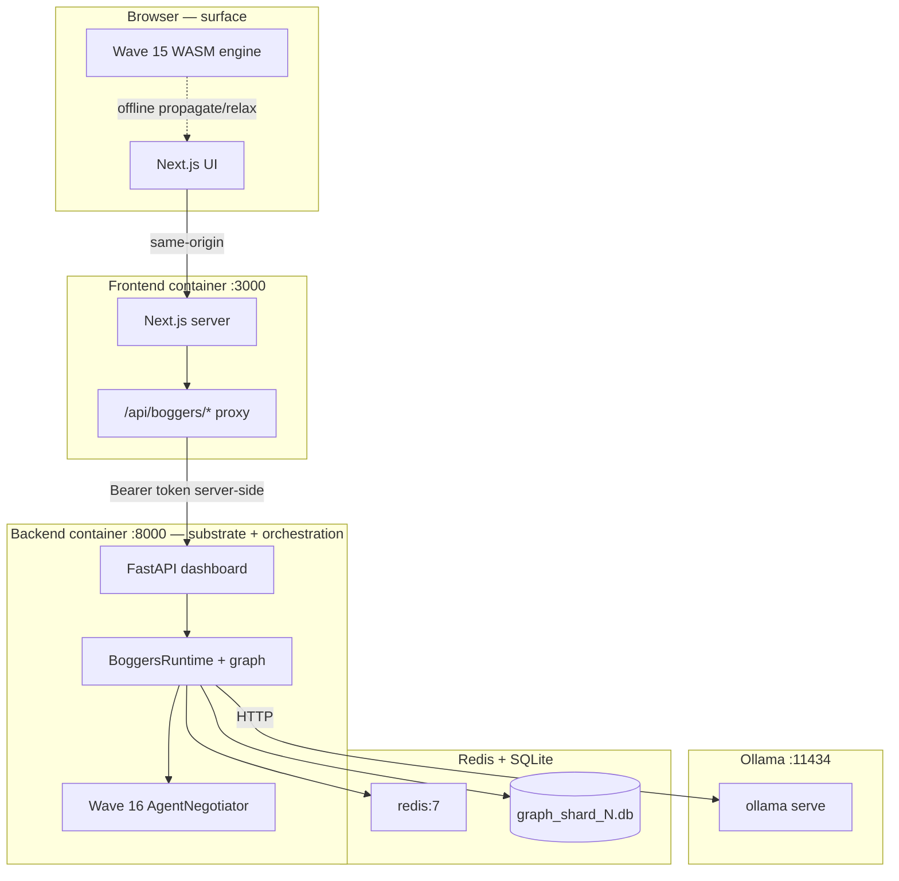

# BoggersTheAI-Dev

**Monorepo for the Thinking System (TS-OS)** — the [**BoggersTheAI**](https://github.com/BoggersTheFish/BoggersTheAI) Python runtime (FastAPI, universal graph, wave cycle, Ollama) plus the Next.js frontend so the **site is not a brochure**: it proxies to a **live** graph-backed API. The client never holds secrets; the browser only talks **same-origin** to `/api/boggers/*`.

In TS terms: **substrate first, surface second.** Retrieval, exploration, and sufficiency run on the graph **before** any LLM token is emitted; streaming is the **language surface** on top of fixed context; an optional **grounding pass** scores confidence and hypotheses without rewriting the streamed answer.

Roadmap through **Wave 16** (complete) — see [boggersthefish.com](https://boggersthefish.com).

---

## Table of contents

1. [Roadmap status](#roadmap-status)
2. [TS execution model](#ts-execution-model)
3. [Architecture](#architecture)
4. [How the site, Lab, and AI connect](#how-the-site-lab-and-ai-connect)
5. [Repository layout](#repository-layout)
6. [Prerequisites](#prerequisites)
7. [Quick start (Docker)](#quick-start-docker)
8. [VPS hosting — step by step](#vps-hosting--step-by-step)
9. [Local development (no Docker)](#local-development-no-docker)
10. [Configuration reference](#configuration-reference)
11. [API surface](#api-surface)
12. [Troubleshooting](#troubleshooting)
13. [Documentation index](#documentation-index)
14. [License](#license)

---

## Roadmap status

| Wave | Label | Status | Notes |
|------|-------|--------|-------|
| **12** | Pages Island LIVE | ✅ Shipped | Baseline: FastAPI + Next.js compose stack |
| **13** | Distributed Sharding | ✅ Complete | Consistent-hash sharding, Redis-backed counts, cross-shard tension pub/sub — [`docs/WAVE13.md`](docs/WAVE13.md) |
| **14** | Docker One-Click | ✅ Shipped | `docker compose up -d --build`, healthchecks, optional Caddy TLS |
| **15** | WebAssembly Port | ✅ Complete | Full `WaveGraph` Rust crate, TypeScript mirror, browser WASM fallback in Lab — [`docs/WAVE15.md`](docs/WAVE15.md) |
| **16** | Multi-Agent Coordination | ✅ Complete | AgentRegistry + AgentNegotiator, tension-based bid protocol, competitive edge weighting, live dashboard — [`docs/WAVE16.md`](docs/WAVE16.md) |

---

## TS execution model

| Layer | What it is | In this repo |
|--------|------------|----------------|
| **Substrate** | Constraint graph + session state: decomposition, activated subgraph, exploration, wave-adjacent work. Must be **settled** (for the query) before language. | `QueryProcessor` pipeline snapshot, SQLite / sharded graph, `GET /graph`, SSE `GET /graph/stream` for live viz. |
| **Surface** | Tokens and UI copy — pressure release on fixed context, not a second retrieval pass. | `POST /query/stream` emits `phase` → `token` → `done`; Next `/chat` consumes the stream after graph phases complete. |
| **Grounding** (optional) | Align **confidence**, **hypotheses**, and **reasoning_trace** with batch-style synthesis **without** replacing the streamed answer text. | `LocalLLM.ground_streamed_answer` when `inference.synthesis.stream_synthesis_grounding_pass` is true (default). |

**Order is fixed:** substrate phases → stream → optional grounding JSON pass. That is the same “TS logic” the public site describes: graph memory is not an appendix to the chat bubble.

---

## Architecture



- **Browser** calls only `/api/boggers/*` (same-origin). `BOGGERS_DASHBOARD_TOKEN` stays server-side.
- **Next proxy** forwards to `BOGGERS_INTERNAL_URL` (Docker network or `127.0.0.1` in dev).
- **Backend** loads `config.docker.yaml` (mounted at `/app/config.yaml`); Ollama at `http://ollama:11434`.
- **Wave 15 WASM**: browser-local fallback — same propagate/relax semantics as Python when the stack is down.
- **Wave 16**: agents negotiate over tense regions of the graph via Redis-backed registry.
- **Graph HTTP**: `GET /graph` and SSE `GET /graph/stream` are rate-limited (gentle) to protect the dashboard from abuse while keeping the UI responsive.

---

## How the site, Lab, and AI connect

| Visitor action | Browser calls | Next.js | Backend | TS layer |
|----------------|---------------|---------|---------|--------|
| Any page | `GET /…` | Renders UI | — | — |
| Lab live stats | `GET /api/boggers/status` | Proxy | `GET /status` | Substrate metrics |
| **Chat / streamed query** | `POST /api/boggers/query/stream` | Proxy + Bearer | `POST /query/stream` → graph phases, then tokens, then optional grounding | Substrate → surface → grounding |
| **Batch query** | `POST /api/boggers/query` | Proxy + Bearer | `POST /query` | Full pipeline in one response |
| Offline Lab | — | — | — | **Wave 15 WASM** = surface-only fallback (local wave math) |
| `/wasm` | `GET /wasm` | Serves page | Optional | WASM or TS mirror |
| `/waves` | `GET /api/boggers/agents/list` | Proxy | Wave 16 registry | Multi-agent substrate |
| Live graph panel | `GET /api/boggers/graph/stream` (SSE) | Proxy | `GET /graph/stream` | Session-filtered substrate snapshot |

---

## Repository layout

| Path | Purpose |
|------|---------|
| `backend/` | BoggersTheAI — FastAPI dashboard, wave engine, graph, all Python |
| `frontend/` | Next.js 15 App Router — lab, wasm, waves, proxy |
| `wasm/ts-os-mini/` | Rust → WASM (wasm-pack): `WaveGraph`, propagate, relax, emergence |
| `config.docker.yaml` | Compose config: Ollama URL, `/data` paths, wave settings |
| `docker-compose.yml` | Services: ollama, redis, backend, frontend; optional caddy (tls profile) |
| `Caddyfile` | TLS + reverse proxy to frontend:3000 |
| `.env.example` | All env vars with defaults |
| `scripts/deploy.sh` | Build + up + model pull + health check |
| `scripts/vps-bootstrap.sh` | Ubuntu one-shot: Docker install → clone → compose → models → verify |
| `scripts/verify-stack.sh` | HTTP health checks against the running stack |
| `scripts/backup-volumes.sh` | Tar backup of all named volumes |
| `scripts/build-wasm.sh` | wasm-pack build → `frontend/public/wasm/ts-os-mini/` |
| `docs/WAVE13.md` | Wave 13: distributed sharding architecture |
| `docs/WAVE15.md` | Wave 15: WASM port architecture |
| `docs/WAVE16.md` | Wave 16: multi-agent coordination architecture |
| `docs/VPS.md` | Firewall, swap, backups, systemd, secrets |
| `systemd/ts-os.service` | systemd unit wrapping `docker compose` |
| `.github/workflows/ts-os-smoke.yml` | CI: compose config, image builds, pytest, Next build, wasm-pack |

---

## Prerequisites

| Requirement | Version | Notes |
|-------------|---------|-------|
| Docker Engine | 24+ | With Docker Compose v2 (`docker compose`) |
| Docker Compose | v2.20+ | Included with Docker Desktop; `docker compose version` to check |
| RAM | ≥ 4 GB | 8 GB+ recommended for Ollama + embeddings |
| Disk | ≥ 20 GB free | Ollama models are large (llama3.2 ≈ 2 GB) |

For local dev (no Docker): Python ≥ 3.10, Node.js 18+, Ollama installed locally.

---

## Quick start (Docker)

```bash
git clone https://github.com/BoggersTheFish/BoggersTheAI-Dev.git
cd BoggersTheAI-Dev

cp .env.example .env
# Optional: set BOGGERS_DASHBOARD_TOKEN=<strong-random-value>

docker compose up -d --build
```

Wait ~60–90 s for all health checks to pass, then:

```bash
# Pull Ollama models (required for LLM responses):
docker compose exec ollama ollama pull llama3.2
docker compose exec ollama ollama pull nomic-embed-text

# Verify:
bash scripts/verify-stack.sh
```

**URLs:**
- Site + Lab: http://localhost:3000
- WASM demo: http://localhost:3000/wasm
- Multi-agent: http://localhost:3000/waves
- Backend API: http://localhost:8000/health/live
- Wave 16 dashboard: http://localhost:8000/agents/dashboard

---

## VPS hosting — step by step

This section explains how to host the full stack on a public VPS (Ubuntu 22.04 / 24.04 recommended) so [boggersthefish.com](https://boggersthefish.com) or your own domain serves the live TS-OS.

### Option A — One-command bootstrap (fastest)

From your VPS (SSH in as a sudo user):

```bash
curl -fsSL https://raw.githubusercontent.com/BoggersTheFish/BoggersTheAI-Dev/main/scripts/vps-bootstrap.sh | sudo bash
```

With a custom domain + automatic HTTPS (Caddy + Let's Encrypt):

```bash
curl -fsSL https://raw.githubusercontent.com/BoggersTheFish/BoggersTheAI-Dev/main/scripts/vps-bootstrap.sh \
  | sudo bash -s -- --domain your.domain.com --tls
```

The script:
1. Installs Docker (if missing)
2. Clones the repo to `/opt/BoggersTheAI-Dev`
3. Creates `.env` with a random `BOGGERS_DASHBOARD_TOKEN`
4. Sets `CADDY_DOMAIN` and `BOGGERS_CORS_ORIGINS` when `--domain` is passed
5. Runs `docker compose up -d --build` (or `--profile tls` with `--tls`)
6. Pulls `llama3.2` and `nomic-embed-text` into Ollama
7. Runs `scripts/verify-stack.sh` to confirm everything is healthy

DNS: point an **A record** (and AAAA if IPv6) for your domain to the VPS IP **before** running with `--tls` (Let's Encrypt needs it to resolve).

---

### Option B — Manual step-by-step

Use this if you want full control or are on a non-Ubuntu distro.

#### 1. Provision the VPS

Recommended specs:
- Ubuntu 22.04 or 24.04 LTS
- 2 vCPU minimum, 4+ for Ollama
- 8 GB RAM (4 GB minimum with swap)
- 40 GB SSD

#### 2. Add swap (important for Ollama on low-RAM servers)

```bash
sudo fallocate -l 8G /swapfile
sudo chmod 600 /swapfile
sudo mkswap /swapfile
sudo swapon /swapfile
echo '/swapfile none swap sw 0 0' | sudo tee -a /etc/fstab
```

#### 3. Install Docker

```bash
curl -fsSL https://get.docker.com | sudo sh
sudo usermod -aG docker $USER
# Log out and back in so group takes effect
newgrp docker
docker --version  # verify
docker compose version  # verify v2
```

#### 4. Open firewall ports

```bash
sudo ufw allow OpenSSH
sudo ufw allow 80/tcp    # HTTP (Caddy redirect or direct)
sudo ufw allow 443/tcp   # HTTPS (Caddy TLS)
sudo ufw enable
# Do NOT expose 8000 (backend), 11434 (Ollama), or 6379 (Redis) publicly
```

#### 5. Clone the repository

```bash
sudo git clone https://github.com/BoggersTheFish/BoggersTheAI-Dev.git /opt/BoggersTheAI-Dev
sudo chown -R $USER:$USER /opt/BoggersTheAI-Dev
cd /opt/BoggersTheAI-Dev
```

#### 6. Configure environment

```bash
cp .env.example .env
```

Edit `.env` with your values:

```env
# Strong random value — protects /status, /graph, /query, etc.
BOGGERS_DASHBOARD_TOKEN=<generate with: openssl rand -hex 32>

# Your domain (used by Caddy for TLS and by CORS config)
CADDY_DOMAIN=your.domain.com

# Allow your domain to call the API directly (same-origin proxy is primary)
BOGGERS_CORS_ORIGINS=https://your.domain.com

# Redis (internal only, do not change unless using external Redis)
REDIS_URL=redis://redis:6379/0

# Wave 13 sharding (optional — leave as 0 unless >10k nodes)
BOGGERS_DISTRIBUTED_ENABLED=0
BOGGERS_SHARD_COUNT=4
BOGGERS_GLOBAL_MAX_NODES=100000
BOGGERS_PER_SHARD_MAX_NODES=25000
```

#### 7. Start the stack

**Without TLS** (HTTP only, port 3000):
```bash
docker compose up -d --build
```

**With TLS** (HTTPS via Caddy, ports 80/443 — requires DNS pointed at this server):
```bash
docker compose --profile tls up -d --build
```

Wait for containers to become healthy (~60–90 seconds):
```bash
docker compose ps
# All should show "healthy"
```

#### 8. Pull Ollama models

```bash
docker compose exec ollama ollama pull llama3.2
docker compose exec ollama ollama pull nomic-embed-text
```

> **Note:** `llama3.2` is ~2 GB. On a slow connection this takes a few minutes. Queries work without models but return extractive (non-LLM) answers until models are pulled.

#### 9. Verify the deployment

```bash
bash scripts/verify-stack.sh
```

This checks:
- `GET /health/live` → backend alive
- `GET /health/ready` → backend ready
- Frontend accessible on port 3000 (or 443 with TLS)
- Wave cycle running

Visit your domain (or `http://<server-ip>:3000`):
- **Home**: site loads
- **Lab** (`/lab`): wave status shows; "Push a Node" returns an AI answer
- **WASM** (`/wasm`): wave cycle runs in browser; shows "TypeScript" badge (upgrade to "WebAssembly" by running `bash scripts/build-wasm.sh` with Rust + wasm-pack)
- **Waves** (`/waves`): multi-agent panel shows 3 active agents; "Negotiate" button triggers a round

#### 10. Set up auto-restart with systemd

```bash
sudo install -m 644 systemd/ts-os.service /etc/systemd/system/ts-os.service

# Edit WorkingDirectory if your clone path differs from /opt/BoggersTheAI-Dev:
sudo sed -i 's|/opt/BoggersTheAI-Dev|'$(pwd)'|g' /etc/systemd/system/ts-os.service

sudo systemctl daemon-reload
sudo systemctl enable --now ts-os.service
sudo systemctl status ts-os.service
```

The stack will now restart automatically on server reboot.

#### 11. Update the deployment

```bash
cd /opt/BoggersTheAI-Dev
git pull
docker compose up -d --build
bash scripts/verify-stack.sh
```

Or use the helper script:
```bash
bash scripts/deploy.sh
```

#### 12. Back up your data

Graph, traces, vault, and Ollama models live in named Docker volumes. Back them up:

```bash
bash scripts/backup-volumes.sh ./backups
```

Restoring:
```bash
# Example: restore boggers-data
docker run --rm -v ts-os_boggers-data:/v -v $(pwd)/backups:/backup alpine \
  tar xzf /backup/boggers-data.tgz -C /v
```

---

### VPS checklist (production)

| # | Task | Command / Notes |
|---|------|-----------------|
| 1 | DNS A record | Point `your.domain.com` → VPS IP |
| 2 | Swap added | `swapon --show` |
| 3 | Docker installed | `docker compose version` |
| 4 | Firewall: 22, 80, 443 only | `sudo ufw status` |
| 5 | `.env` with strong token | `BOGGERS_DASHBOARD_TOKEN` set |
| 6 | Stack healthy | `docker compose ps` all green |
| 7 | Ollama models pulled | `docker compose exec ollama ollama list` |
| 8 | TLS working | `curl -I https://your.domain.com` → 200 |
| 9 | systemd unit enabled | `systemctl is-enabled ts-os` |
| 10 | Backup cron set | `crontab -e` → `0 3 * * * bash /opt/.../backup-volumes.sh ...` |

---

### Updating to a new wave

When a new wave ships:

```bash
cd /opt/BoggersTheAI-Dev
git pull
docker compose up -d --build   # rebuilds only changed layers
bash scripts/verify-stack.sh
```

No data is lost — volumes are separate from the containers.

---

## Local development (no Docker)

### Backend

```bash
cd backend
pip install -e ".[llm,adapters,agents]"
# Ensure Ollama is running locally; create/edit backend/config.yaml
dashboard-start
# → http://localhost:8000
```

### Frontend

```bash
cd frontend
npm install
cp .env.example .env.local
# BOGGERS_INTERNAL_URL=http://127.0.0.1:8000
# BOGGERS_DASHBOARD_TOKEN=<match backend>
npm run dev
# → http://localhost:3000
```

### WASM (optional)

```bash
# Requires Rust + wasm-pack (https://rustwasm.github.io/wasm-pack/)
bash scripts/build-wasm.sh
# → frontend/public/wasm/ts-os-mini/
# The /wasm page will show "WebAssembly" badge instead of "TypeScript"
```

---

## Configuration reference

| Variable | Default | Purpose |
|----------|---------|---------|
| `BOGGERS_DASHBOARD_TOKEN` | *(empty)* | Protects all authenticated endpoints. Set a strong random value in production. |
| `BOGGERS_DASHBOARD_HOST` | `127.0.0.1` | FastAPI bind address. Compose sets `0.0.0.0`. |
| `BOGGERS_DASHBOARD_PORT` | `8000` | FastAPI port. |
| `BOGGERS_CORS_ORIGINS` | `http://localhost:3000` | Browser-to-backend CORS. Set to your real domain in production. |
| `BOGGERS_INTERNAL_URL` | `http://backend:8000` | Next.js → backend URL (server-only). |
| `NEXT_PUBLIC_BOGGERS_API_BASE` | `/api/boggers` | Client-side API prefix. |
| `REDIS_URL` | `redis://redis:6379/0` | Wave 13 agent queue + Wave 16 registry. Falls back to memory if unreachable. |
| `CADDY_DOMAIN` | `localhost` | Domain for Caddy TLS profile. |
| `BOGGERS_DISTRIBUTED_ENABLED` | `0` | Set `1` to activate Wave 13 sharding (multi-shard SQLite). |
| `BOGGERS_SHARD_COUNT` | `4` | Number of SQLite shard files when distributed is enabled. |
| `BOGGERS_GLOBAL_MAX_NODES` | `100000` | Global node cap across all shards. |
| `BOGGERS_PER_SHARD_MAX_NODES` | `25000` | Per-shard node cap. |

YAML config for graph, wave, Ollama, and emergence parameters lives in `config.docker.yaml` (Docker) or `backend/config.yaml` (local). Key values:

```yaml
inference.ollama.model: "llama3.2"        # chat model
inference.ollama.base_url: "http://ollama:11434"
inference.synthesis.stream_synthesis: true
inference.synthesis.stream_synthesis_grounding_pass: true  # post-stream JSON: confidence / hypotheses / trace
embeddings.model: "nomic-embed-text"      # embedding model
wave.interval_seconds: 30                 # wave cycle frequency
wave.tension_threshold: 0.20              # emergence threshold
guardrails.max_nodes: 5000               # safety cap (in-memory)
```

---

## API surface

All routes are proxied by Next.js under `/api/boggers/*`.

| Route | Auth | Purpose |
|-------|------|---------|
| `GET /health/live` | No | Liveness probe |
| `GET /health/ready` | Token | Readiness + health checks |
| `GET /status` | Token | Wave cycle stats + node/edge counts |
| `GET /graph` | Token | Full graph JSON (rate-limited) |
| `GET /graph/stream` | Token | SSE: periodic graph JSON (same shape as `/graph`; rate-limited) |
| `GET /graph/viz` | Token | Cytoscape.js interactive graph |
| `POST /query` | Token | Full query pipeline (graph → synthesis) in one shot |
| `POST /query/stream` | Token | SSE: `phase` (substrate) → `token` (surface) → `done` with optional grounding metadata |
| `GET /wave` | Token | Chart.js tension dashboard |
| `GET /metrics` | Token | Graph + wave metrics |
| `GET /metrics/prometheus` | Token | Prometheus text format |
| `GET /traces` | Token | Recent reasoning traces |
| **Wave 13** | | |
| `GET /distributed/status` | Token | Shard coordinator health |
| `GET /distributed/shards` | Token | Per-shard SQLite node counts |
| `GET /distributed/tension` | Token | Live tension with shard assignments |
| `POST /distributed/assign` | Token | Dry-run shard allocation check |
| **Wave 13 agents** | | |
| `GET /agents/status` | Token | Queue depth + backend (Redis/memory) |
| `POST /agents/tasks` | Token | Enqueue agent task |
| `POST /agents/tasks/wait` | Token | Dequeue one task (blocking) |
| **Wave 16** | | |
| `GET /agents/list` | Token | Active agents + negotiation weights |
| `POST /agents/register` | Token | Register a new agent perspective |
| `POST /agents/negotiate` | Token | Run one negotiation round |
| `GET /agents/dashboard` | Token | HTML multi-agent dashboard |

---

## Troubleshooting

| Symptom | Fix |
|---------|-----|
| Lab shows "Offline or unreachable" | `docker compose ps` — all healthy? `BOGGERS_DASHBOARD_TOKEN` must match `backend` and `frontend`. `curl http://localhost:8000/health/live` |
| `401 Unauthorized` | Set `BOGGERS_DASHBOARD_TOKEN` in `.env`, then `docker compose up -d --force-recreate` |
| Answers feel repeated / `[throttle]` | Lower `inference.throttle_seconds` in `config.docker.yaml`, then `docker compose restart backend` |
| Ollama errors / no LLM answer | `docker compose exec ollama ollama pull llama3.2` — wait for download |
| High memory usage | Reduce `guardrails.max_nodes` in config; add swap (see [VPS step 2](#2-add-swap-important-for-ollama-on-low-ram-servers)) |
| TLS / Caddy fails | DNS must point to VPS before Let's Encrypt will issue cert; check `docker compose --profile tls logs caddy` |
| Agent negotiation returns no results | Needs ≥2 active agents + graph tension > 0. Run `POST /query` first to generate graph activity, then `POST /agents/negotiate` |
| Wave 15 WASM shows "TypeScript" badge | Expected — TypeScript fallback is identical math. Build native WASM: `bash scripts/build-wasm.sh` (needs Rust + wasm-pack) |
| Redis errors | Redis is optional; agents fall back to in-memory queue automatically |
| Distributed sharding 404 | Set `BOGGERS_DISTRIBUTED_ENABLED=1` in `.env`, then rebuild |

---

## Documentation index

| Doc | Contents |
|-----|----------|
| [`docs/VPS.md`](docs/VPS.md) | Firewall, swap, backups, systemd, secrets, rate limiting |
| [`docs/WAVE13.md`](docs/WAVE13.md) | Distributed sharding: ShardCoordinator, ShardedGraphLayer, Redis pub/sub |
| [`docs/WAVE15.md`](docs/WAVE15.md) | WASM port: Rust WaveGraph, TypeScript mirror, browser query fallback |
| [`docs/WAVE16.md`](docs/WAVE16.md) | Multi-agent: AgentRegistry, AgentNegotiator, negotiation protocol |

---

## License

Upstream projects retain their own licenses (BoggersTheAI: MIT). This integration layer follows the same spirit; see `LICENSE` files under `backend/` and `frontend/` for exact terms.

---

*Keep this README aligned with the TS execution model when changing query flow, streaming, compose services, env vars, or proxy paths.*
